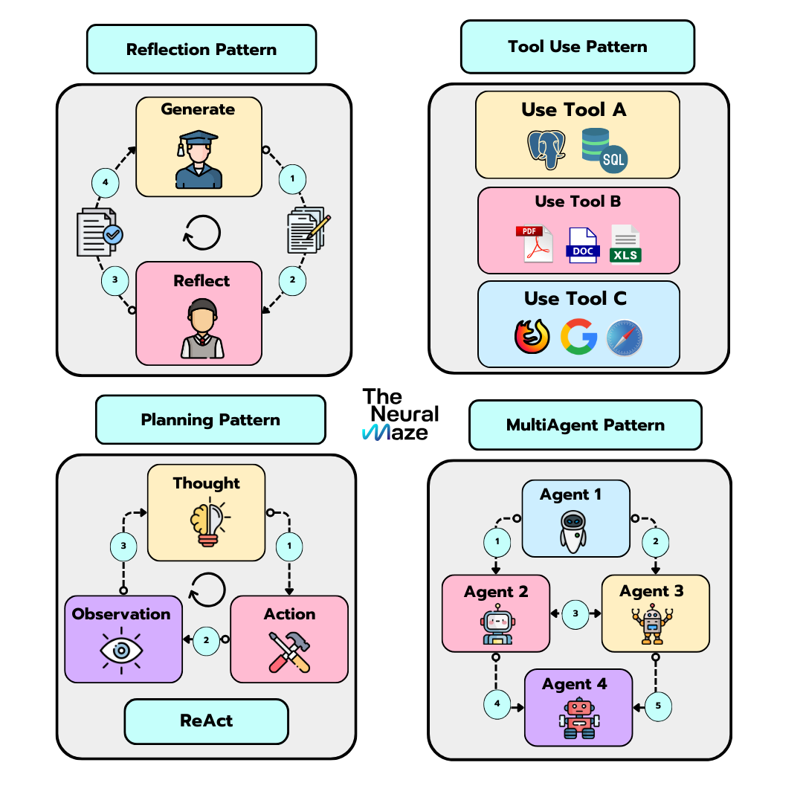

# Agentic Patterns

A comprehensive repository demonstrating various AI agent design patterns and architectures. This project showcases different strategies for building intelligent agents that can reason, use tools, reflect, and collaborate.

## Overview

This repository implements four key agentic patterns used in modern AI systems:

1. **Reflection Pattern** - Agents that self-evaluate and improve their outputs iteratively
2. **Tool Pattern** - Agents that can call and use external tools to accomplish tasks
3. **ReAct Pattern** - Agents that operate with Thought-Action-Observation loops for reasoning
4. **Multiagent Pattern** - Multiple specialized agents working together as a cohesive crew

## Project Structure

```
agentic_patterns/
├── main.py                          # Entry point and demo functions
├── multiagent_pattern/
│   ├── agent.py                     # Individual agent implementation
│   └── crew.py                      # Agent crew orchestration
├── reAct_pattern/
│   └── react_agent.py               # ReAct pattern agent
├── reflection_pattern/
│   ├── reflection_agent.py          # Reflection pattern agent
│   └── utils.py                     # Utility functions
└── tool_pattern/
    ├── extraction.py                # Tool output extraction
    ├── tool_agent.py                # Tool-using agent
    ├── tool.py                      # Tool definitions and decorators
    └── utils.py                     # Utility functions
```

## Patterns Explained

### 1. Reflection Pattern

The Reflection Pattern implements a self-evaluation loop where an agent:
- **Generates** an initial response to a user query
- **Reflects** by critiquing the response for accuracy, clarity, and completeness
- **Improves** the response based on the critique
- Repeats until a satisfactory answer is produced

**Use Case:** Complex problems requiring iterative refinement and self-correction

### 2. Tool Pattern

The Tool Pattern enables agents to:
- **Access** a set of predefined functions/tools
- **Call** the appropriate tools to solve problems
- **Process** tool outputs and generate responses

Available tools include:
- Math operations: `add()`, `multiply()`, `divide()`, `simple_interest()`
- Text operations: `reverse_text()`, `to_upper()`, `count_words()`
- Utility functions: `is_even()`

**Use Case:** Tasks requiring access to external functions or APIs

### 3. ReAct Pattern

The ReAct Pattern implements a reasoning loop with three steps:
- **Thought** - Agent reasons about the problem
- **Action** - Agent calls available tools
- **Observation** - Agent processes the tool results

This loop repeats until the agent reaches a conclusion.

**Use Case:** Complex multi-step problems requiring intermediate reasoning

### 4. Multiagent Pattern

The Multiagent Pattern features:
- **Multiple Specialized Agents** - Each agent has specific expertise
- **Crew Coordination** - Agents work together to solve complex tasks
- **Task Distribution** - Work is divided among agents based on their capabilities

**Use Case:** Large projects requiring diverse skills and parallel execution

## Getting Started

### Prerequisites

- Python 3.8+
- Groq API key (for LLM access)
- Required dependencies (see Installation)

### Installation

1. Clone the repository:
```bash
git clone <repository-url>
cd AgenticPatterns
```

2. Install dependencies:
```bash
pip install -r requirements.txt
```

3. Set up environment variables:
Create a `.env` file in the root directory:
```env
GROQ_API_KEY=your_api_key_here
```

### Usage

Run the main module to interact with different agent patterns:

```bash
python src/agentic_patterns/main.py
```

Example interactions:

```python
# Reflection Agent - Self-improving responses
from reflection_pattern.reflection_agent import ReflectionAgent
agent = ReflectionAgent()
response = agent.run("Explain quantum computing")

# Tool Agent - Using available tools
from tool_pattern.tool_agent import ToolAgent
agent = ToolAgent(tools=[...])
response = agent.process("Calculate 10 * 5")

# ReAct Agent - Reasoning with actions
from reAct_pattern.react_agent import ReactAgent
agent = ReactAgent()
response = agent.run("What is 20% of 150?")
```

## Configuration

### LLM Model Selection

All agents support different LLM models. Default: `llama-3.3-70b-versatile`

```python
agent = ReflectionAgent(model="your-model-name")
```

### Custom Tools

Define custom tools using the `@tool` decorator:

```python
from tool_pattern.tool import tool

@tool
def my_function(param1: str, param2: int) -> str:
    """Description of what this tool does"""
    return f"Result: {param1} - {param2}"
```

## Dependencies

- `groq` - LLM API client
- `colorama` - Terminal color formatting
- `python-dotenv` - Environment variable management

## Key Features

✅ Multiple agent pattern implementations
✅ LLM-agnostic architecture (uses Groq API)
✅ Tool/function calling capability
✅ Self-reflection and improvement loops
✅ Multi-agent collaboration framework
✅ Easy-to-extend design with decorators
✅ Built-in utility tools for common tasks

## Contributing

Contributions are welcome! Feel free to:
- Add new agent patterns
- Implement additional tools
- Improve existing implementations
- Add tests and documentation

## License

[Add your license here]

## References

- [Chain-of-Thought Prompting](https://arxiv.org/abs/2201.11903)
- [ReAct: Synergizing Reasoning and Acting in Language Models](https://arxiv.org/abs/2210.03629)
- [Reflection-based Multi-agent Architectures](https://arxiv.org/abs/2410.02771)

## Support

For questions or issues, please open an issue on the repository.
